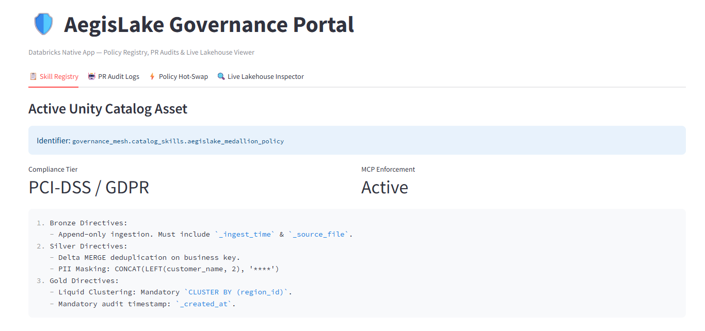
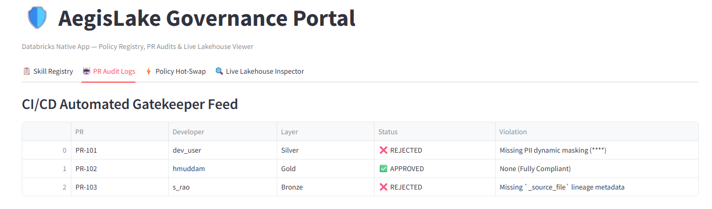
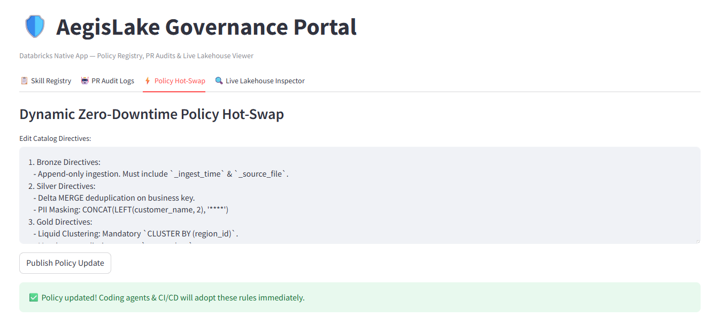
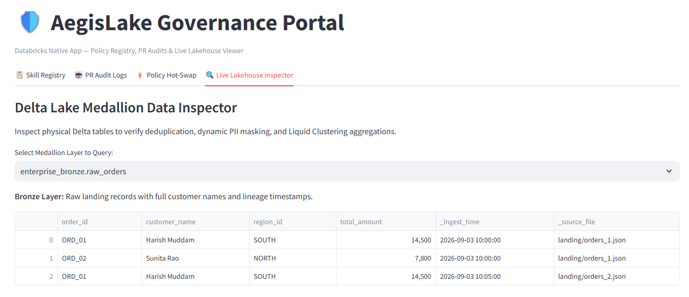
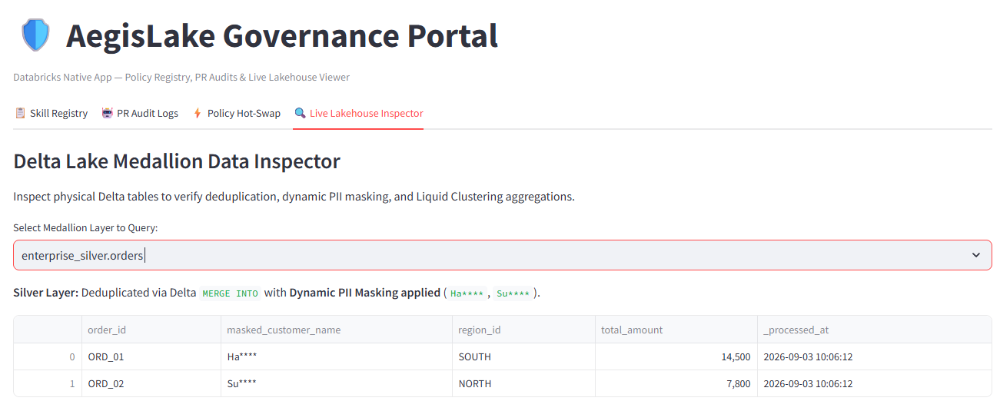
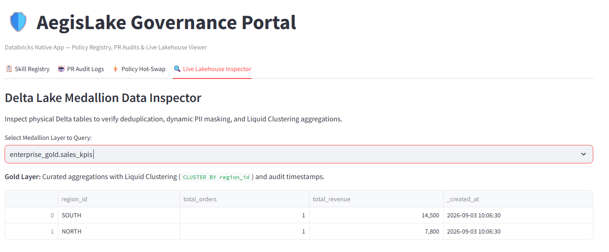

# 🛡️ AegisLake: Governed Lakehouse Orchestration Mesh

> Decoupling enterprise prompt engineering and compliance rules into first-class Unity Catalog assets with automated CI/CD PR gating and a native Databricks App management portal.

---

## 🏗️ Architectural Overview

```
```
aegislake-governed-mesh/assets/Architecture.png

```

---
## 🖥️ Live Databricks App UI & Control Center

Hosted natively on Databricks Apps, enabling platform architects to monitor real-time compliance and execute zero-downtime policy hot-swaps.

### 1. Catalog Skill Registry
Enforcing governance rules as catalog securables with active Model Context Protocol (MCP) bridges.


### 2. CI/CD Automated PR Gatekeeper Feed
Live audit stream recording bot decisions and blocking PRs violating PII or performance directives.


### 3. Dynamic Zero-Downtime Policy Hot-Swap
Modifying Lakehouse directives centrally and propagating updates across coding agents instantly.


---

## 🔍 End-to-End Medallion Governance Inspector

### 4. Bronze Layer (Raw & Unprocessed)
Raw ingestion batches with source lineage timestamps and unmasked identifiers:


### 5. Silver Layer (Deduplication & Dynamic PII Masking)
Idempotent Delta Lake `MERGE INTO` with dynamic masking applied to sensitive identifiers:


### 6. Gold Layer (Liquid Clustered Aggregations)
Aggregated business KPIs clustered by region (`CLUSTER BY region_id`) with lineage stamps:


---

## 🛠️ Tech Stack
* **Lakehouse Engine:** Databricks, Delta Lake (Liquid Clustering, Delta MERGE), PySpark
* **Application Layer:** Databricks Apps, Streamlit, Python 3.10
* **Governance & Security:** Unity Catalog Securables, RBAC, Dynamic PII Masking
* **CI/CD & Agentic Ops:** GitHub Actions, Model Context Protocol (MCP)
* **Orchestration:** Databricks Workflows (Daily Scheduled Jobs with Automated Retries)
